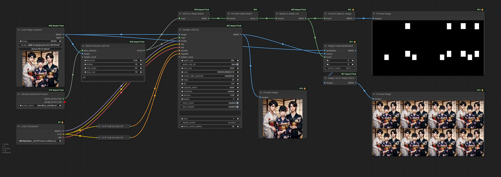

# ComfyUI-MaskBatchPermutations
 Permutes a mask batch to present possible additive combinations. Passing a mask batch (e.g. out of [SEGS to Mask Batch](https://github.com/ltdrdata/ComfyUI-Impact-Pack)) will return a new mask batch representing all the possible combinations of the included masks. So, a mask batch with two mask sections, "A" and "B, will return a batch containing an empty mask, an empty mask & A, an empty mask & B, and an empty mask & A & B.
 ## example workflow
 
 This image contains an embedded workflow.
 ## why?
 "Automatic" face detailing without direct operator intervention usually works well, but occasionally it wrecks an otherwise good face. Instead of having to hand compose them back together in something like GIMP and fix the metadata, I decided to create this instead.
